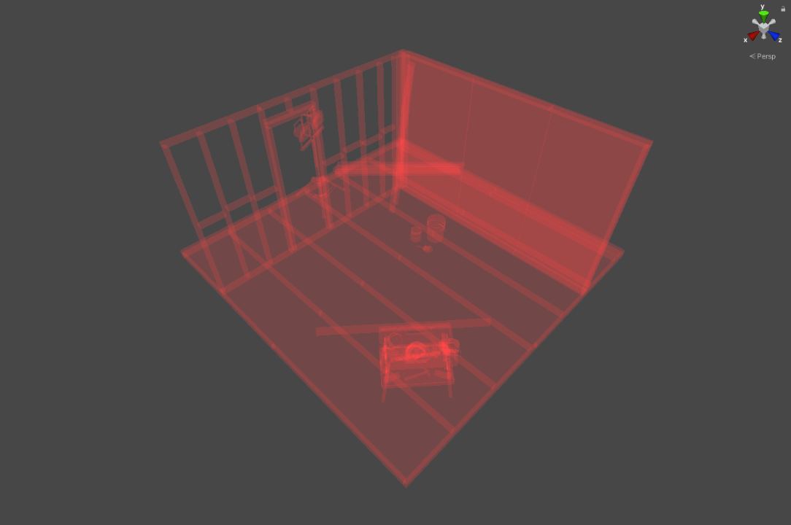
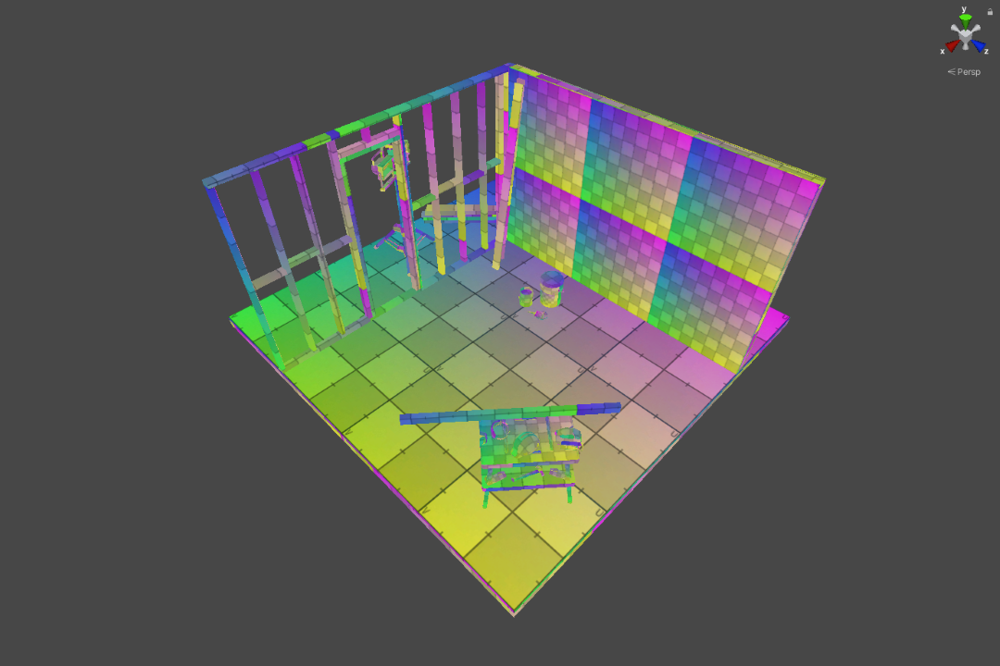
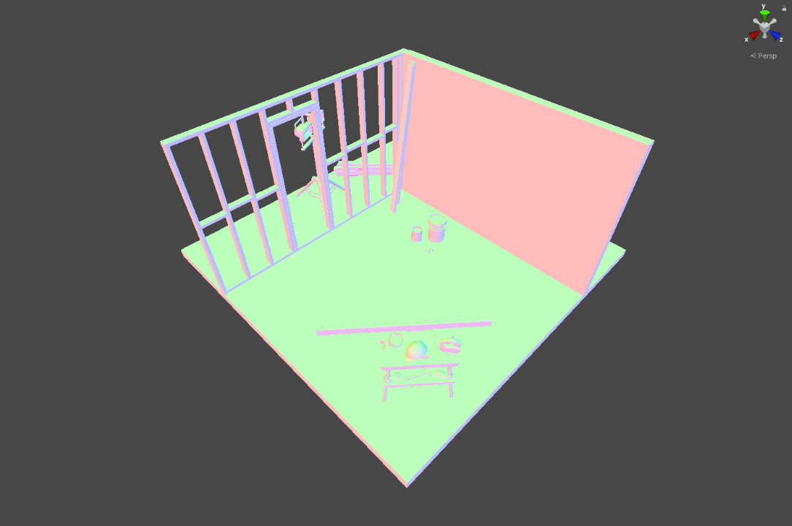

# TAO - Scene Debug Viewer

A small debugging tool to draw the editor scene with replacement shaders. This can be helpful when blocking out a level or finding issues within the scene.

## Features

- User presets
  - Shader and parameter configuration
- Included examples
  - Base color
  - Triplanar grid (lit and unlit)
  - World and object space normals
  - Overdraw
  - UV checker

## Getting Started

SceneDebugViewer:
> Window/Analysis/SceneDebugViewer

ReplacementShaderSetup:
> Assets/Create/SceneDebugViewer/ReplacementShaderSetup

## Install

[Installing from a Git URL](https://docs.unity3d.com/Manual/upm-ui-giturl.html)

## LICENSE

Overall package is licensed under [MIT](/LICENSE.md), unless otherwise noted in the [3rd party licenses](/THIRD%20PARTY%20NOTICES.md) file and/or source code.